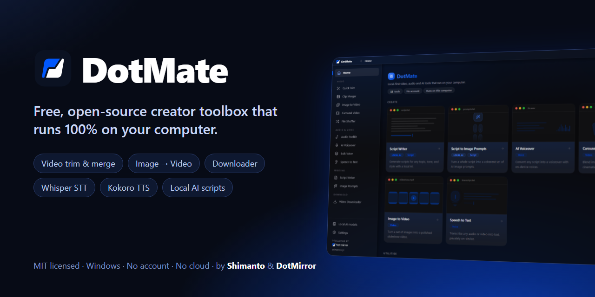
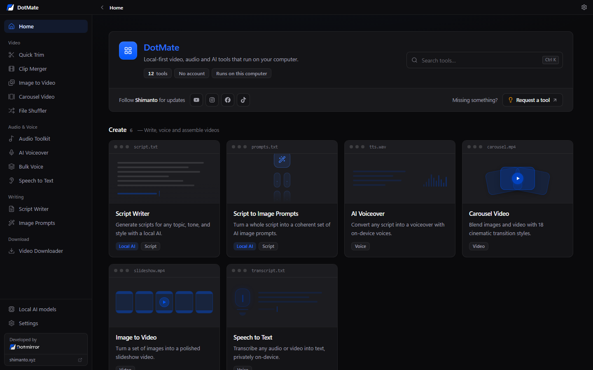
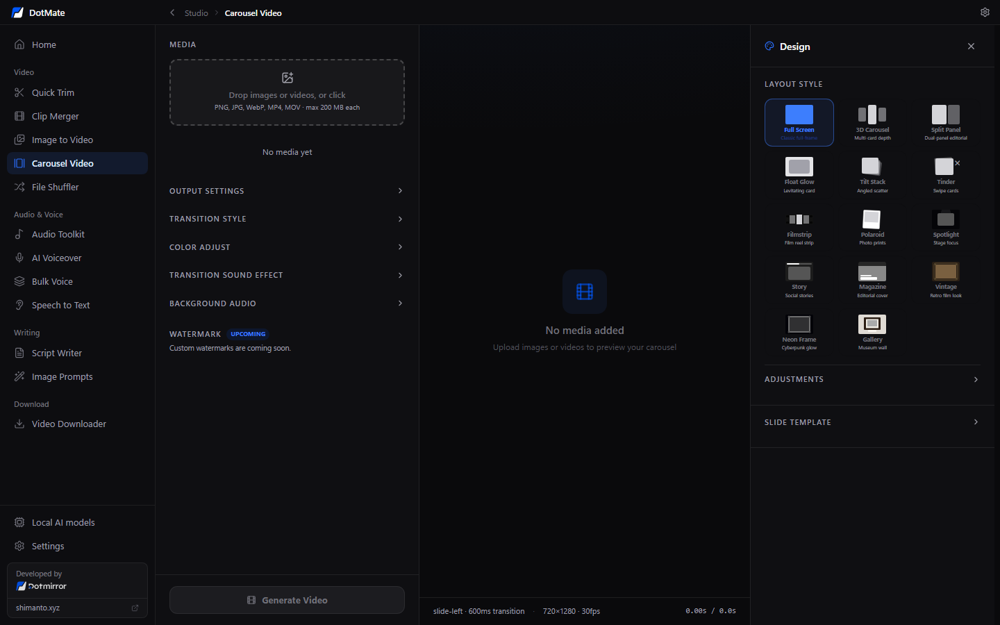
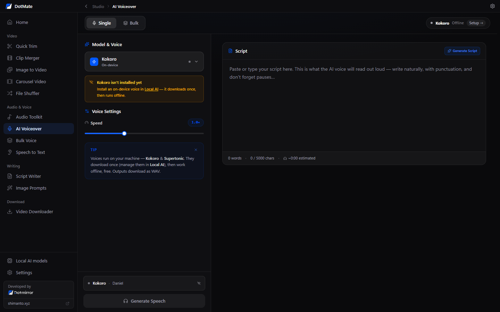
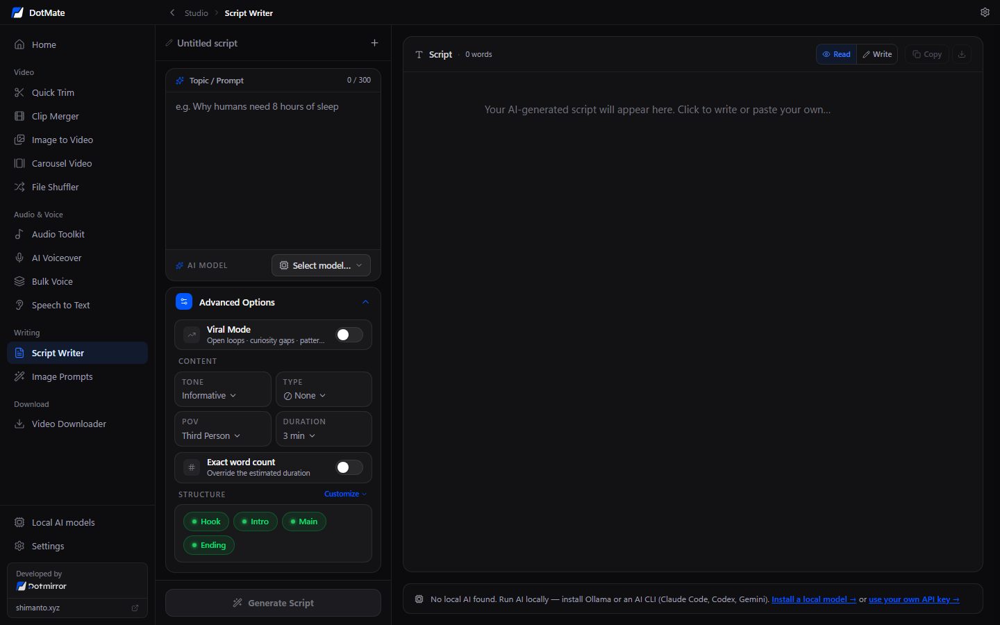
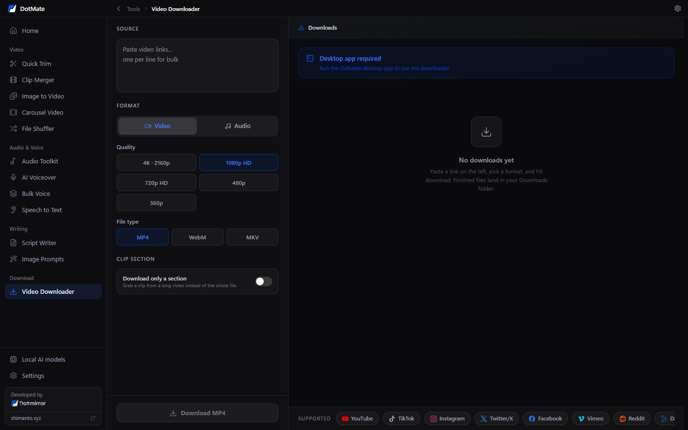
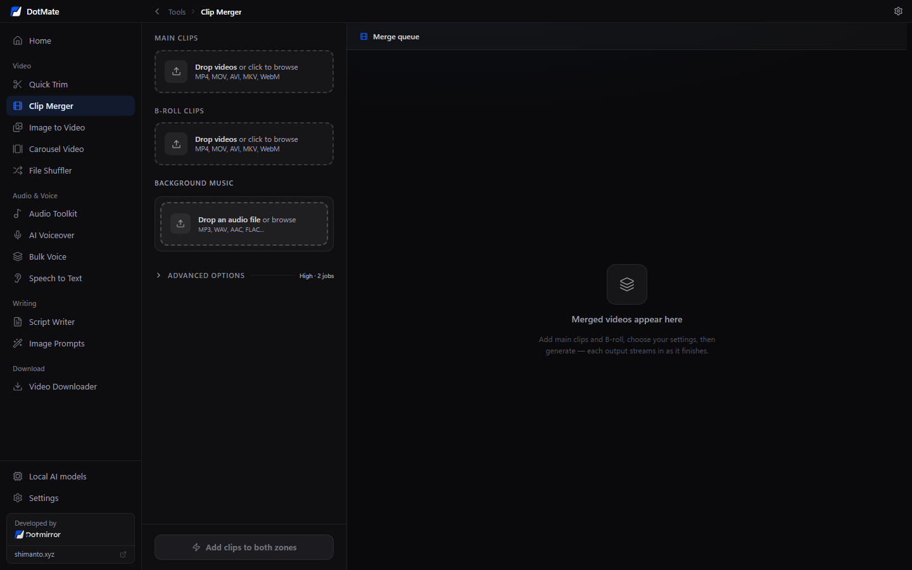

<div align="center">

<a href="https://shimentosh.github.io/dotmate/">
  
</a>

# DotMate — Free Offline Video, Voice & AI Toolbox for Creators

**Trim and merge videos, turn images into videos, download from YouTube & TikTok, transcribe with Whisper, generate voiceovers with Kokoro TTS and write scripts with a local LLM — all in one desktop app that runs 100% on your own computer.**

No account. No subscription. No cloud. No telemetry. Open source under the MIT licence.

[](LICENSE)
[](#-download--install)
[](https://tauri.app)
[](https://nextjs.org)
[](https://www.rust-lang.org)
[](https://github.com/shimentosh/dotmate/actions/workflows/ci.yml)
[](https://github.com/shimentosh/dotmate/stargazers)

[**Website**](https://shimentosh.github.io/dotmate/) ·
[**Download**](https://github.com/shimentosh/dotmate/releases/latest) ·
[**Features**](#-features) ·
[**Build from source**](docs/BUILDING.md) ·
[**Report a bug**](https://github.com/shimentosh/dotmate/issues/new/choose)

</div>

---

## 📖 Table of contents

- [Why DotMate?](#-why-dotmate)
- [Features](#-features)
- [Screenshots](#-screenshots)
- [Download & install](#-download--install)
- [Local AI: how it works](#-local-ai-how-it-works)
- [Privacy](#-privacy)
- [Build from source](#-build-from-source)
- [Tech stack](#-tech-stack)
- [Roadmap](#-roadmap)
- [Contributing](#-contributing)
- [FAQ](#-faq)
- [Authors](#-authors)
- [License](#-license)

## ✨ Why DotMate?

Most creator tools live in the browser, need an account, upload your files to a
server, and put the useful parts behind a paywall. **DotMate** is the opposite:

- 🔒 **Private by design** — your videos, audio and scripts never leave your computer.
- 💸 **Free forever** — no credits, no watermark, no subscription, no "pro" tier.
- ✈️ **Works offline** — after a one-time download of FFmpeg and the models you pick,
  every tool except the Video Downloader works without internet.
- 🧠 **Local AI** — speech-to-text with [Whisper](https://github.com/ggml-org/whisper.cpp),
  text-to-speech with [Kokoro](https://huggingface.co/hexgrad/Kokoro-82M), and script
  writing with [Ollama](https://ollama.com) or the Claude Code / Codex / Gemini CLIs you already use.
- ⚡ **Fast and small** — a ~12 MB installer built on [Tauri 2](https://tauri.app) and Rust,
  with hardware-accelerated video encoding through WebCodecs where your PC supports it.
- 🧰 **12 tools in one app** — replace a handful of websites and single-purpose apps.

## 🧰 Features

### 🎬 Video

| Tool | What it does |
|---|---|
| **Quick Trim** | **Batch Clips:** drop several long recordings, mark as many short moments as you like (2.5 s by default, drag to slide or resize, edit any clip later) and export the whole queue as `clip_001.mp4 … clip_500.mp4` at the source resolution and frame rate. **Trim Files:** batch-trim many whole videos with one draggable range. |
| **Clip Merger** | Pair main clips with random B-roll, add background music, pick aspect-ratio presets, run in batches. |
| **Image to Video** | Turn photos into a slideshow video with effects, colour adjustment, a progress bar, your own watermark and music. |
| **Carousel Video** | Mix images and videos with 18 cinematic transitions, layout styles, sound effects and music — great for Reels, Shorts and TikTok. |
| **File Shuffler** | Randomise names, order and dates of video files and export them as a ZIP or into a folder. |

### 🎙️ Audio & voice

| Tool | What it does |
|---|---|
| **Audio Toolkit** | Merge, loop or extract audio (MP3 / WAV) from audio and video files. |
| **AI Voiceover** | Text-to-speech on your PC — 10 natural Kokoro voices (plus 10 optional Supertonic voices), single or bulk. |
| **Bulk Voice** | Turn many scripts into many voice files in one run. |
| **Speech to Text** | Transcribe audio, video or a microphone recording with on-device Whisper (tiny / base / small models). |

### ✍️ Writing (local LLM)

| Tool | What it does |
|---|---|
| **Script Writer** | Long-form YouTube / short-form video scripts with tone, point of view, duration, structure and "viral mode" controls; streams the answer and sends it straight to AI Voiceover. |
| **Script to Image Prompts** | Split a script into scenes and write an image-generation prompt for each one. |

### ⬇️ Download

| Tool | What it does |
|---|---|
| **Video Downloader** | Download videos and audio from YouTube, TikTok, Instagram, X (Twitter) and [1000+ sites supported by yt-dlp](https://github.com/yt-dlp/yt-dlp/blob/master/supportedsites.md) — playlists, sections and optional cookies.txt. |

**Plus:** a guided first-run setup, light & dark themes, a render dock that keeps
progress visible while you switch tools, a guard that stops you from losing a
running export, and minimise-to-tray.

## 📸 Screenshots

<table>
  <tr>
    <td width="50%"></td>
    <td width="50%"></td>
  </tr>
  <tr>
    <td align="center"><b>Home</b> — every tool, one click away</td>
    <td align="center"><b>Carousel Video</b> — 18 transitions, layouts, music</td>
  </tr>
  <tr>
    <td></td>
    <td></td>
  </tr>
  <tr>
    <td align="center"><b>AI Voiceover</b> — offline Kokoro text-to-speech</td>
    <td align="center"><b>Script Writer</b> — local LLM via Ollama or CLI</td>
  </tr>
  <tr>
    <td></td>
    <td></td>
  </tr>
  <tr>
    <td align="center"><b>Video Downloader</b> — powered by yt-dlp</td>
    <td align="center"><b>Clip Merger</b> — B-roll, music, aspect presets</td>
  </tr>
</table>

## 📥 Download & install

1. Download the latest **`DotMate_x.y.z_x64-setup.exe`** from
   [**GitHub Releases**](https://github.com/shimentosh/dotmate/releases/latest).
2. Run the installer (per-user or per-machine).
3. On first launch DotMate opens a short **setup screen**:
   - **FFmpeg** and **yt-dlp** are always installed (downloaded once from their official publishers).
   - **Whisper (base)** and **Kokoro** voices are pre-selected and optional.
   - **Ollama + Llama 3.2** is optional, for the writing tools.

Everything can be installed, changed or removed later in **Settings → Local AI**.

**Requirements:** Windows 10 or 11 (x64), the Microsoft Edge WebView2 runtime (built
into Windows 11; the installer fetches it on Windows 10), and internet once for the
first-run downloads.

> [!NOTE]
> Releases may not be code-signed yet, so Windows SmartScreen can show
> "Windows protected your PC". Click **More info → Run anyway**, or
> [build it yourself](docs/BUILDING.md). macOS configuration exists but is
> untested — see [macOS status](docs/BUILDING.md#macos-status).

## 🧠 Local AI: how it works

| Capability | Engine | Size | Where it comes from |
|---|---|---|---|
| Speech to text | [whisper.cpp](https://github.com/ggml-org/whisper.cpp) (tiny / base / small) | 75–466 MB | Hugging Face `ggerganov/whisper.cpp` |
| Text to speech | [Kokoro-82M](https://huggingface.co/hexgrad/Kokoro-82M) via [sherpa-onnx](https://github.com/k2-fsa/sherpa-onnx) | ~330 MB | k2-fsa/sherpa-onnx GitHub releases |
| Text to speech (optional) | [Supertonic 3](https://github.com/supertone-inc/supertonic) | — | Self-hosted archive ([how](docs/BUILDING.md#optional-supertonic-voices)) |
| Script writing | [Ollama](https://ollama.com) (Llama 3.2, Qwen 2.5, any chat model) | your choice | Installed from Settings → Local AI → Brain |
| Script writing | Claude Code, Codex CLI or Gemini CLI | — | Install and sign in yourself; DotMate detects them |

CLI "brains" run in read-only / plan mode with the prompt on stdin, inside a scratch
folder — they cannot touch your files.

## 🔒 Privacy

- The UI **never talks to a remote server**. Its only network access is to a local
  Ollama (`localhost`); the Content-Security-Policy blocks everything else.
- All downloads (FFmpeg, yt-dlp, models) are made by the Rust side from the
  official URLs listed in [`src-tauri/src/sources.rs`](src-tauri/src/sources.rs).
- No analytics, no crash reporting, no login. Settings live on your PC.

## 🛠️ Build from source

```bash
git clone https://github.com/shimentosh/dotmate.git
cd dotmate
corepack enable
pnpm install
pnpm tauri:dev      # run the desktop app in development mode
pnpm tauri:build    # build the Windows installer
```

You need Node.js 20+, Rust (MSVC toolchain), Visual Studio 2022 Build Tools,
CMake and LLVM. The complete guide — environment variables, low-RAM tips,
optional voices, reproducible builds and troubleshooting — is in
**[docs/BUILDING.md](docs/BUILDING.md)**. How the code is organised is explained
in **[docs/ARCHITECTURE.md](docs/ARCHITECTURE.md)**.

## 🧱 Tech stack

- **Desktop shell:** [Tauri 2](https://tauri.app) (Rust) with WebView2
- **UI:** [Next.js 16](https://nextjs.org) static export, [React 19](https://react.dev), [Tailwind CSS 4](https://tailwindcss.com), [Zustand](https://github.com/pmndrs/zustand), [Lucide](https://lucide.dev)
- **Video in the browser engine:** [Mediabunny](https://github.com/Vanilagy/mediabunny) + WebCodecs
- **Native media:** [FFmpeg](https://ffmpeg.org), [yt-dlp](https://github.com/yt-dlp/yt-dlp)
- **On-device AI:** [whisper-rs](https://github.com/tazz4843/whisper-rs), [sherpa-onnx](https://github.com/k2-fsa/sherpa-onnx), [ONNX Runtime](https://onnxruntime.ai), [Ollama](https://ollama.com)

## 🗺️ Roadmap

- [ ] Signed Windows releases built by GitHub Actions
- [ ] Fully working macOS build (Apple Silicon + Intel)
- [ ] Linux build (AppImage / .deb)
- [ ] Custom watermarks in Carousel Video
- [ ] More languages and voices
- [ ] Auto-updates

Have an idea? [Open a feature request](https://github.com/shimentosh/dotmate/issues/new?template=feature_request.yml)
or start a [discussion](https://github.com/shimentosh/dotmate/discussions).

## 🤝 Contributing

Contributions of every size are welcome — bug reports, translations, docs, new
tools and fixes. Please read **[CONTRIBUTING.md](CONTRIBUTING.md)** and our
**[Code of Conduct](CODE_OF_CONDUCT.md)** before opening a pull request. Security
issues: see **[SECURITY.md](SECURITY.md)**.

If DotMate saves you time, **please give it a ⭐ on GitHub** — it helps other
creators find it.

## ❓ FAQ

<details>
<summary><b>Is DotMate really free?</b></summary>

Yes. DotMate is free and open source under the MIT licence. There are no credits,
watermarks, accounts or paid tiers.
</details>

<details>
<summary><b>Does DotMate work offline?</b></summary>

Yes. After the first-run download of FFmpeg and the models you choose, every tool
except Video Downloader works without an internet connection.
</details>

<details>
<summary><b>Do my files get uploaded anywhere?</b></summary>

No. All processing happens on your computer. The app has no server and no
telemetry.
</details>

<details>
<summary><b>Do I need a powerful GPU for the AI tools?</b></summary>

No. Whisper (tiny/base) and Kokoro run on a normal CPU. Ollama models run faster
with a GPU but small models such as Llama 3.2 3B work on most modern laptops.
</details>

<details>
<summary><b>Is it a CapCut / Descript / ElevenLabs alternative?</b></summary>

For many everyday jobs — batch trimming, slideshows, carousel videos, voiceovers
and transcripts — yes, and it runs offline. It is not a full timeline editor.
</details>

<details>
<summary><b>Does it run on macOS or Linux?</b></summary>

Windows 10/11 is the supported platform today. macOS configuration exists but is
untested, and Linux is on the roadmap. Help is very welcome!
</details>

<details>
<summary><b>Something went wrong — where are the logs?</b></summary>

Settings → General → <b>Open logs folder</b>. See
<a href="docs/TROUBLESHOOTING.md">docs/TROUBLESHOOTING.md</a> for common fixes.
</details>

## 👥 Authors

DotMate is built and maintained by:

<table>
  <tr>
    <td align="center" width="200">
      <a href="https://github.com/shimentosh"><br><b>Shimanto</b></a><br>
      <sub>Creator & lead developer</sub><br>
      <sub><a href="https://shimanto.xyz">shimanto.xyz</a> · <a href="https://github.com/shimentosh">@shimentosh</a></sub>
    </td>
    <td align="center" width="200">
      <a href="https://dotmirror.com"><br><b>DotMirror</b></a><br>
      <sub>Studio behind DotMate</sub><br>
      <sub><a href="https://dotmirror.com">dotmirror.com</a></sub>
    </td>
  </tr>
</table>

And every [contributor](https://github.com/shimentosh/dotmate/graphs/contributors) 💙

## 🙏 Acknowledgements

DotMate stands on the shoulders of great open-source projects: Tauri, Next.js,
React, FFmpeg, yt-dlp, whisper.cpp, sherpa-onnx, Kokoro, ONNX Runtime, Ollama,
Mediabunny and many more. Full list and licences:
[THIRD_PARTY_NOTICES.md](THIRD_PARTY_NOTICES.md).

## 📄 License

DotMate's source code is released under the **[MIT License](LICENSE)** —
© 2026 Shimanto and DotMirror.

Third-party components keep their own licences. In particular, FFmpeg (GPL-3.0)
is downloaded at runtime, and the Kokoro TTS libraries include espeak-ng
(GPL-3.0); see [THIRD_PARTY_NOTICES.md](THIRD_PARTY_NOTICES.md). Please use the
Video Downloader only for content you have the right to download.

<div align="center">
<br>
<sub>Made with 💙 by <a href="https://shimanto.xyz">Shimanto</a> & <a href="https://dotmirror.com">DotMirror</a> · <a href="https://shimentosh.github.io/dotmate/">shimentosh.github.io/dotmate</a></sub>
</div>
